# RLDE-AFL

the official code implementation of RLDE-AFL

the README is going to be refined progressively 
<!-- which is accepted as a full paper in GECCO 2025 -->

## overview

<!-- 这里应该有大致论文里introduction的东西 -->
<!-- 那张图有点不妥就不想放 -->
<!-- 以及引用是否还是用这个 -->

### the conventional mutations

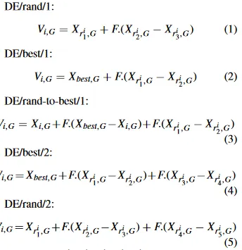

<!-- 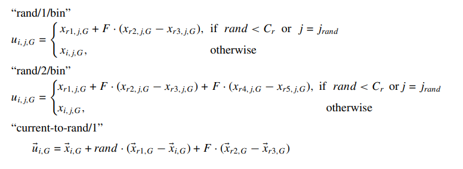 -->

### novel mutations

<!-- | NAME                                                                                      | MUTATION                                                                                                                                  | LINK                                                                        |
| ----------------------------------------------------------------------------------------- | ----------------------------------------------------------------------------------------------------------------------------------------- | --------------------------------------------------------------------------- |
| MDE                                                                                       | 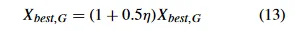                                                                            | [MDE](introduction/novel_mutation/mutation1_MDE/mutation1.pdf)              |
| ?                                                                                         | 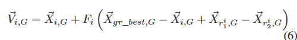                                                                            | [mutation2](introduction/novel_mutation/mutation2/mutation2.pdf)            |
| JADE                                                                                      | 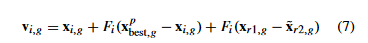                                                                          | [JADE](introduction/novel_mutation/mutation3_JADE/mutation3-jade.pdf)       |
| Differential evolution with topographical mutation applied to nuclear reactor core design | 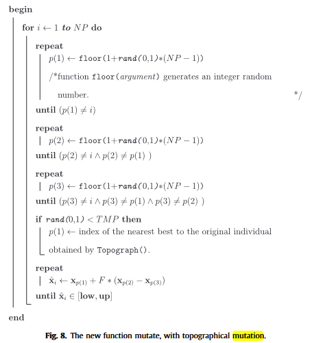                                                                                  | [mutation4](introduction/novel_mutation/mutation4/mutation4.pdf)            |
| Proposed Proximity-Based Mutation Framework                                               | 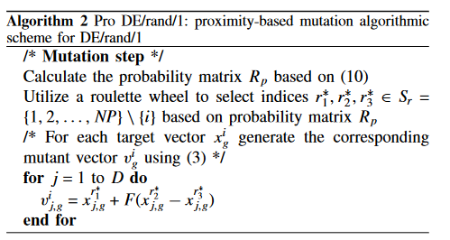                                                                          | [mutation5](introduction/novel_mutation/mutation5/mutation5.pdf)            |
| MADDE                                                                                     | 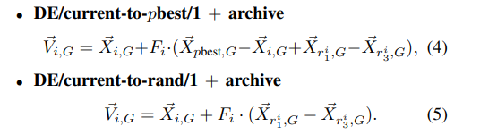 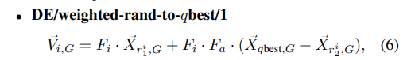 | [MADDE](introduction/novel_mutation/mutation6_MADDE/mutation6-MADDE.pdf)    |
| HARDDE                                                                                    | 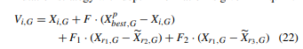                                                                      | [HARDDE](introduction/novel_mutation/mutation8-HARDDE/mutation8-HARDDE.pdf) |
| An Improved Differential Evolution Algorithm and Its Applications to Orbit Design         | 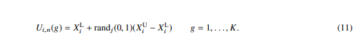                                                                                  | [mutation9](introduction/novel_mutation/mutation9/mutation9.pdf)            | -->
<!-- 这个太碎了，而且有些没用上，需要重写 -->

## Crossover part

### conventional crossover

### novel crossover

## The Structure