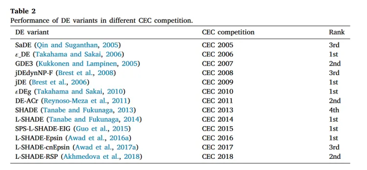

# DE-mutation-collection

for new work that requires collections of de mutations

## overview

(there should be some information for different de and their effectiveness(?))

 
<a href="overview/overview.pdf">paper link</a>

## Mutation part

### the conventional mutations

  
| NAME | origin | link |
| ---- | ------ | ---- |

### novel mutations

| NAME                                                                                      | MUTATION                                                                                                                                  | LINK                                                                        |
| ----------------------------------------------------------------------------------------- | ----------------------------------------------------------------------------------------------------------------------------------------- | --------------------------------------------------------------------------- |
| MDE                                                                                       |                                                                             | [MDE](introduction/novel_mutation/mutation1_MDE/mutation1.pdf)              |
| ?                                                                                         |                                                                             | [mutation2](introduction/novel_mutation/mutation2/mutation2.pdf)            |
| JADE                                                                                      |                                                                           | [JADE](introduction/novel_mutation/mutation3_JADE/mutation3-jade.pdf)       |
| Differential evolution with topographical mutation applied to nuclear reactor core design |                                                                                   | [mutation4](introduction/novel_mutation/mutation4/mutation4.pdf)            |
| Proposed Proximity-Based Mutation Framework                                               |                                                                           | [mutation5](introduction/novel_mutation/mutation5/mutation5.pdf)            |
| MADDE                                                                                     |   | [MADDE](introduction/novel_mutation/mutation6_MADDE/mutation6-MADDE.pdf)    |
| HARDDE                                                                                    |                                                                       | [HARDDE](introduction/novel_mutation/mutation8-HARDDE/mutation8-HARDDE.pdf) |
| An Improved Differential Evolution Algorithm and Its Applications to Orbit Design         |                                                                                   | [mutation9](introduction/novel_mutation/mutation9/mutation9.pdf)            |

## Crossover part

### conventional crossover

- exponential crossover
- 
### novel crossover

## The Structure

introduction folder contains the source for this markdown

src folder contains the source code for the project

population and costs --> FE --> mutation selection --> mutaiton configuration --> perform the mutation --> crossover selection -->configuration(if necessary) --> perform the crossover --> get new population --> get new cost

## Some tips

we need to carefully read all the papers to check whether we should do some change for several weird mutations.

## Process

### Finished mutations

- all conventional mutations: rand1, rand2, rand to best, best1, best2, rand1bin,rand2bin
- JADE
- MDE_pBX(mutation2)
- HARDDE
- SA-RM-DE(mutation9)

### UNFINISHED

### HAVE PROBLEMS

- MDE (not working or the algorithm is not suitable for this work)(finished(?))
- MADDE (a combination of many many algorithm and it is too stupid)(not finished)
- SA_RM_best_1(maybe there is a problem with its origin algorithm)
- some algorithm's sample may have possible bugs
